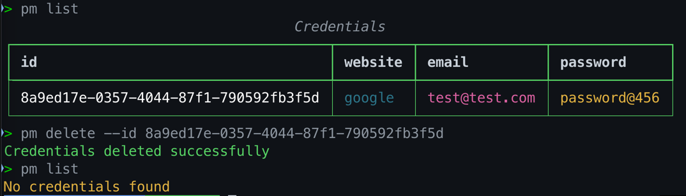

# Password Manager

## Pre-requisites

- Python 3.6 or higher
- pip
- docker

## pip packages

```commandline
pip install typer
```

```commandline
pip install uuid
```

```commandline
pip install psycopg2-binary
```

## Docker

```commandline
docker pull postgres
docker run --name <container_name> -e POSTGRES_PASSWORD=mysecretpassword -p <port_number>:5432 -d postgres
docker exec -it <container_name> bash
su - postgres
psql
\du
CREATE ROLE <docker_user_name> with login SUPERUSER PASSWORD '<docker_user_password>';
ALTER USER <docker_user_name> WITH CREATEDB CREATEROLE;
docker volume create postgres-volume
docker run --name <container_name> -e POSTGRES_PASSWORD=<docker_user_name -e POSTGRES_USER=<docker_user_password> -p 5433:5432 -v pgdata:/var/lib/postgresql/data -d postgres
```

### Installation
```commandline
python setup.py bdist_wheel && cd dist && pip install pwd_mgr-1.1-py3-none-any.whl --force-reinstall && cd ..
```

## Usage
help
```commandline
pm --help
```


Configure the tool with db details

```commandline
pm configure
```


List all the credentials

```commandline
pm list
```


Save a new credential

```commandline
pm save -w <website> -u <username> -p <password>
```


Update a credential

```commandline
pm update --id <id> -w <website> -u <username> -p <password>
```


Delete a credential

```commandline
pm delete --id <id>
```
